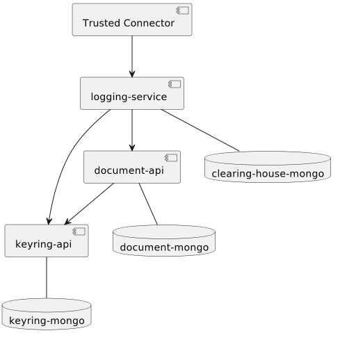

# IDS Clearing House
The IDS Clearing House Service is a prototype implementation of the [Clearing House](https://github.com/International-Data-Spaces-Association/IDS-RAM_4_0/blob/main/documentation/3_Layers_of_the_Reference_Architecture_Model/3_5_System_Layer/3_5_5_Clearing_House.md) component of the [Industrial Data Space](https://internationaldataspaces.org/). 

Data in the Clearing House is stored encrypted and practically immutable. There are multiple ways in which the Clearing House enforces Data Immutability:
- Using the `Logging Service` there is no way to update an already existing log entry in the database
- Log entries in the database include a hash value of the previous log entry, chaining together all log entries. Any change to a previous log entry would require rehashing all following log entries.
- The connector logging information in the Clearing House receives a signed receipt from the Clearing House that includes among other things a timestamp and the current chain hash. A single valid receipt in possession of any connector is enough to detect any change to data up to the time indicated in the receipt.

## Architecture
The IDS Clearing House Service currently implements the [`Logging Service`](https://github.com/International-Data-Spaces-Association/IDS-RAM_4_0/blob/main/documentation/3_Layers_of_the_Reference_Architecture_Model/3_5_System_Layer/3_5_5_Clearing_House.md). Other services that comprise the [Clearing House](https://github.com/International-Data-Spaces-Association/IDS-RAM_4_0/blob/main/documentation/3_Layers_of_the_Reference_Architecture_Model/3_5_System_Layer/3_5_5_Clearing_House.md) may follow. The Clearing House Service consists of two parts:

1. [`Clearing House App`](clearing-house-app)
2. [`Clearing House Processors`](clearing-house-processors)

The `Clearing House App` is a REST API written in [Rust](https://www.rust-lang.org) that implements the business logic of the Clearing House. The `Clearing House Processors` is a library written in Java that integrates the `Clearing House App` into the [Trusted Connector](https://github.com/industrial-data-space/trusted-connector). The `Clearing House Processors` provide the `multipart` and `idscp2` endpoints described in the [IDS-G](https://github.com/International-Data-Spaces-Association/IDS-G/tree/main) (or [IDS-G-Pre](https://github.com/International-Data-Spaces-Association/IDS-G-Pre/tree/main)). These are used by the IDS connectors to interact with the Clearing House. Both `Clearing House App` and `Clearing House Processors` are needed to provide the `Clearing House Service`.

## Requirements
- [OpenSSL](https://www.openssl.org)
- [MongoDB](https://www.mongodb.com)
- ([Docker](https://www.docker.com))
- [Trusted Connector](https://github.com/industrial-data-space/trusted-connector)

## Trusted Connector
The Clearing House Service API requires a Trusted Connector [Trusted Connector](https://github.com/industrial-data-space/trusted-connector) for deployment. The process of setting up a Trusted Connector is described [here](https://industrial-data-space.github.io/trusted-connector-documentation/docs/getting_started/). Using a docker image of the Trusted Connector should be sufficient for most deployments:

`docker pull fraunhoferaisec/trusted-connector-core:6.3.0`

The Clearing House Processors are written in Java for use in the Camel Component of the Trusted Connector. To configure the Trusted Connector for the Clearing House Service API it needs access to the following files inside the docker container (e.g. mounted as a volume):
- `clearing-house-processors.jar`: The Clearing House Processors need to be placed in the `/root/jars` folder of the Trusted Connector. The jar file needs to be [build](clearing-house-processors#building-from-source) from the Clearing House Processors using `gradle`.
- [`clearing-house-routes.xml`](clearing-house-processors/src/routes/clearing-house-routes.xml): The camel routes required by the Clearing House need to be placed in the `/root/deploy` folder of the Trusted Connector.

Besides those files that are specific for the configuration of the Clearing House Service API, the Trusted Connector requires other files for its configuration, e.g. a truststore and a keystore with appropriate key material. Please refer to the [Documentation](https://industrial-data-space.github.io/trusted-connector-documentation/) of the Trusted Connector for more information or check the [Examples](https://github.com/industrial-data-space/trusted-connector/tree/master/examples).

#### Environment Variables
The Clearing House Processors can override some standard configuration settings of the Trusted Connector using environment variables. If these variables are not set, the Clearing House Processors will use the standard values provided by the Trusted Connector. Some of the variables are mandatory and have to be set:
- `TC_DAPS_URL`: The url of the DAPS used by the Clearing House. The Trusted Connector uses `https://daps.aisec.fraunhofer.de/v2` as the default DAPS url.
- `TC_KEYSTORE_PW`: The password of the key store mounted in the Trusted Connector. Defaults to `password`.
- `TC_TRUSTSTORE_PW`: The password of the trust store mounted in the Trusted Connector. Defaults to `password`.
- `TC_CH_ISSUER_CONNECTOR`(mandatory): Issuer connector needed for IDS Messages as specified by the [InfoModel](https://github.com/International-Data-Spaces-Association/InformationModel)
- `TC_CH_AGENT`(mandatory): Server agent needed for IDS Messages as specified by the [InfoModel](https://github.com/International-Data-Spaces-Association/InformationModel)


#### Example Configuration (docker-compose)
```
tc-core:
    container_name: "tc-core"
    image: fraunhoferaisec/trusted-connector-core:6.3.0
    tty: true
    stdin_open: true
    volumes:
        - /var/run/docker.sock:/var/run/docker.sock
        - ./data/trusted-connector/allow-all-flows.pl:/root/deploy/allow-all-flows.pl
        - ./data/trusted-connector/ch-ids.p12:/root/etc/keystore.p12
        - ./data/trusted-connector/truststore.p12:/root/etc/truststore.p12
        - ./data/trusted-connector/clearing-house-processors-0.8.0.jar:/root/jars/clearing-house-processors.jar
        - ./data/trusted-connector/routes/clearing-house-routes.xml:/root/deploy/clearing-house-routes.xml
    environment:
        TC_DAPS_URL: https://<my-daps-url>
    ports:
        - "8443:8443"
        - "9999:9999"
        - "29292:29292"
```


## Docker Containers
The dockerfiles located [here](docker/) can be used to create containers for the services of the [`Clearing House App`](clearing-house-app). There are two types of dockerfiles:
1. Simple builds (e.g. [dockerfile](docker/keyring-api.Dockerfile)) that require you to build the Service APIs yourself using [Rust](https://www.rust-lang.org)
2. Multistage builds (e.g. [dockerfile](docker/keyring-api-multistage.Dockerfile)) that have a stage for building the rust code

To build the containers check out the repository and in the main directory execute

`docker build -f docker/<dockerfile> . -t <image-name>`

### Container Dependencies


### Configuration
Please read the Configuration section of the service ([`Logging Service`](https://github.com/Fraunhofer-AISEC/ids-clearing-house-service/tree/architecture-revamp/clearing-house-app#logging-service), [`Document API`](https://github.com/Fraunhofer-AISEC/ids-clearing-house-service/tree/architecture-revamp/clearing-house-app#document-api), [`Keyring API`](https://github.com/Fraunhofer-AISEC/ids-clearing-house-service/tree/architecture-revamp/clearing-house-app#keyring-api)) you are trying to run, before using `docker run` oder `docker-compose`. All Containers build with the provided dockerfiles require two volumes:
1. The configuration file `Rocket.toml`is expected at `/server/Rocket.toml`
2. The folder containing the DAPS certificate is expected at `/server/certs`

Containers of the Keyring API require an additional volume:

3. `/server/init_db` needs to contain the `default_doc_type.json`

Containers of the Logging Service require an additional volume:

3. The folder containing the signing key needs to match the path configured for the signing key in `Rocket.toml`, e.g. `/sever/keys`

Please note that if you are not using the default DAPS, [additional steps](clearing-house-app#daps) are required.
